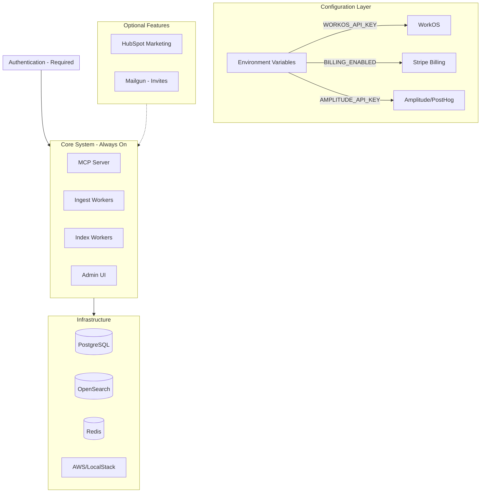

# Open Source Grapevine Migration Plan (Dual-Use)

This plan transforms Grapevine into a dual-use codebase supporting both the commercial SaaS and self-hosted open source deployments. Each phase can be committed independently.**Key Principle**: Keep all SaaS functionality intact but make it configurable. Open source users get a working system with features disabled by default; SaaS continues unchanged with features enabled.---

## Phase 1: Vendor Gather Design System

Copy the compiled Gather design packages into the repository to remove private npm registry dependency. This is a self-contained change with no functional impact.

### Steps

1. **Create vendor directory structure:**
   ```javascript
                              js-services/vendor/
                              ├── @gathertown/
                              │   ├── gather-design-system/
                              │   └── gather-design-foundations/
   ```


2. **Copy packages from node_modules:**

- Copy entire `node_modules/@gathertown/gather-design-system` to `js-services/vendor/@gathertown/gather-design-system/`
- Copy entire `node_modules/@gathertown/gather-design-foundations` to `js-services/vendor/@gathertown/gather-design-foundations/`

3. **Update package.json references:**

- In [`js-services/package.json`](js-services/package.json), change dependencies to use `file:` protocol:
     ```json
                                                  "@gathertown/gather-design-system": "file:./vendor/@gathertown/gather-design-system",
                                                  "@gathertown/gather-design-foundations": "file:./vendor/@gathertown/gather-design-foundations"
     ```


4. **Update .yarnrc.yml:**

- Remove or comment out the `@gathertown` npm scope configuration in [`js-services/.yarnrc.yml`](js-services/.yarnrc.yml)

5. **Update .gitignore:**

- Ensure `js-services/vendor/` is NOT ignored (it should be committed)

6. **Test build:**

- Run `yarn install && yarn build` to verify everything works

---

## Phase 2: Make SaaS Features Configurable

Make billing, analytics, and marketing integrations configurable via environment variables. All disabled by default for open source, enabled via config for SaaS.

### 2.1 Billing System (Configurable)

**Add configuration flag:**

- Add `BILLING_ENABLED` environment variable (default: `false`)

**Backend changes:**

- Update [`js-services/admin-backend/src/services/billing-service.ts`](js-services/admin-backend/src/services/billing-service.ts):
- Check `BILLING_ENABLED` before any billing operations
- Return "billing disabled" responses when disabled
- Update [`js-services/admin-backend/src/stripe-client.ts`](js-services/admin-backend/src/stripe-client.ts):
- Only initialize Stripe client if `BILLING_ENABLED=true`
- Update billing controller endpoints to return 404/disabled when billing is off

**Frontend changes:**

- Update [`js-services/admin-frontend/src/components/billing/BillingPage.tsx`](js-services/admin-frontend/src/components/billing/BillingPage.tsx):
- Hide billing UI when disabled (check via API or config endpoint)
- Update navigation/sidebar to conditionally show billing links

### 2.2 Analytics (Optional, No-Op Default)

**Python services:**

- Update [`src/utils/amplitude.py`](src/utils/amplitude.py):
- Return no-op `AmplitudeService` if `AMPLITUDE_API_KEY` not set
- Update [`src/utils/posthog.py`](src/utils/posthog.py):
- Return no-op `PostHogService` if `POSTHOG_API_KEY` not set
- Update [`src/utils/tracing.py`](src/utils/tracing.py):
- Disable Langfuse if `LANGFUSE_PUBLIC_KEY` not set (already partially done)

**TypeScript services:**

- Update [`js-services/frontend-common/src/analytics/service.ts`](js-services/frontend-common/src/analytics/service.ts):
- Return no-op service if `VITE_AMPLITUDE_API_KEY` not set
- Update [`js-services/backend-common/src/analytics/service.ts`](js-services/backend-common/src/analytics/service.ts):
- Return no-op service if analytics keys not configured

**NewRelic:**

- Update NewRelic initialization in all services to check for `NEW_RELIC_LICENSE_KEY`
- No-op or skip initialization if not configured

### 2.3 Marketing & Notifications

**Remove Zapier webhook entirely:**

- Delete `_send_zapier_notification()` function from [`src/steward/tenant_provisioner.py`](src/steward/tenant_provisioner.py)
- Remove all calls to Zapier webhook in provisioning flow
- Remove `ZAPIER_WEBHOOK_ENDPOINT` from environment/config

**Make HubSpot marketing optional:**

- Update [`js-services/admin-backend/src/marketing-hubspot-client.ts`](js-services/admin-backend/src/marketing-hubspot-client.ts):
- Return no-op client if `HUBSPOT_MARKETING_API_KEY` not set

**Make Mailgun optional (with documentation):**

- Update [`js-services/admin-backend/src/mailgun-client.ts`](js-services/admin-backend/src/mailgun-client.ts):
- Return no-op client if `MAILGUN_API_KEY` not set
- Log warning that email invites are disabled
- **Document clearly**: Without Mailgun configured, user invitation emails will not be sent
- Update invite flow to show error/warning in UI when Mailgun is not configured

### 2.4 Gather-Specific Auth (Optional)

- Update [`js-services/admin-backend/src/config/gather-auth-config.ts`](js-services/admin-backend/src/config/gather-auth-config.ts):
- Ensure Gather auth is disabled when not configured
- Update Firebase config in [`src/utils/config.py`](src/utils/config.py):
- Return None gracefully when Firebase env vars not set

---

## Phase 3: Environment and Configuration

Improve configuration for dual-use deployment with sensible defaults for open source.

### 3.1 Create Example Environment File

Create `.env.example` at repository root with documented variables:

```bash
# === Required for all deployments ===
DATABASE_URL=postgresql://...
CONTROL_DATABASE_URL=postgresql://...
OPENSEARCH_DOMAIN_HOST=localhost
OPENSEARCH_PORT=9200
REDIS_PRIMARY_ENDPOINT=redis://localhost:6379
OPENAI_API_KEY=sk-...

# === AWS (required - use LocalStack for local dev) ===
AWS_REGION=us-east-1
AWS_ENDPOINT_URL=http://localhost:4566  # LocalStack
SQS_INGEST_QUEUE=grapevine-ingest
SQS_INDEX_QUEUE=grapevine-index
KMS_KEY_ID=alias/grapevine

# === Authentication (WorkOS required) ===
WORKOS_API_KEY=
WORKOS_CLIENT_ID=

# === Optional: Billing (SaaS only) ===
BILLING_ENABLED=false
STRIPE_SECRET_KEY=
STRIPE_WEBHOOK_SECRET=

# === Optional: Analytics ===
AMPLITUDE_API_KEY=
POSTHOG_API_KEY=
NEW_RELIC_LICENSE_KEY=
LANGFUSE_PUBLIC_KEY=
LANGFUSE_SECRET_KEY=

# === Optional: Marketing ===
HUBSPOT_MARKETING_API_KEY=

# === Optional: Email (required for user invitations) ===
MAILGUN_API_KEY=
MAILGUN_DOMAIN=
```


### 3.2 Update Config Defaults

- Update [`src/utils/config.py`](src/utils/config.py):
- Add `get_billing_enabled()` function (default `False`)
- Add `get_analytics_enabled()` helper functions
- Ensure all optional services have safe defaults
- Update TypeScript config:
- [`js-services/admin-backend/src/utils/config.ts`](js-services/admin-backend/src/utils/config.ts)
- [`js-services/admin-frontend/src/lib/config.ts`](js-services/admin-frontend/src/lib/config.ts)

### 3.3 Remove Doppler Hard Dependencies

- Update scripts that require Doppler to work without it:
- [`scripts/run_with_project.sh`](scripts/run_with_project.sh)
- [`scripts/connector_wrapper.sh`](scripts/connector_wrapper.sh)
- [`scripts/backfill_wrapper.sh`](scripts/backfill_wrapper.sh)
- Make Doppler optional (use if available, otherwise use env vars directly)

### 3.4 Update Docker/Kubernetes Configs

- Update [`docker-compose.yml`](docker-compose.yml):
- Add comments explaining LocalStack vs AWS usage
- Ensure all services can start with minimal config
- Update kustomize overlays:
- Create `kustomize/overlays/opensource/` for self-hosted deployments
- Document which secrets are required vs optional

---

## Phase 4: Branding (Optional)

Light branding updates to clarify open source nature while keeping Grapevine name.

### 4.1 Domain References

- Search and update hardcoded `getgrapevine.ai` references
- Make base domain fully configurable
- Update email templates if any

### 4.2 README Updates

- Add open source badges (license, build status, etc.)
- Add "Powered by Grapevine" or similar for derivative works
- Update screenshots/diagrams if needed

---

## Phase 5: Documentation

Create comprehensive documentation for self-hosted deployments while keeping SaaS docs intact.

### 5.1 New Documentation Files

**`docs/SELF_HOSTING.md`** - Complete guide:

- Prerequisites (PostgreSQL, OpenSearch, Redis, AWS/LocalStack)
- Quick start with Docker Compose
- Production deployment with Kubernetes
- Upgrading and maintenance

**`docs/CONFIGURATION.md`** - Environment variables:

- Required vs optional variables
- Feature flags and their effects
- Example configurations for different setups

**`docs/AUTH_SETUP.md`** - Authentication setup:

- WorkOS configuration and setup
- Claim mapping and tenant resolution

**`docs/INFRASTRUCTURE.md`** - Infrastructure requirements:

- AWS services needed and IAM permissions
- LocalStack setup for development
- PostgreSQL with pgvector
- OpenSearch cluster sizing

### 5.2 Update Existing Documentation

- Update [`README.md`](README.md):
- Add "Self-Hosting" section
- Simplify initial setup for open source users
- Keep developer setup instructions
- Update [`AGENTS.md`](AGENTS.md):
- Note dual-use nature of codebase
- Document feature flag patterns

### 5.3 License and Community Files

- Add `LICENSE` file (recommend Apache 2.0 or MIT)
- Add `CONTRIBUTING.md` with contribution guidelines
- Add `CODE_OF_CONDUCT.md`

---

## Architecture Summary (Dual-Use)

