## Executive Summary

Attio is a modern, highly customizable CRM platform with a well-documented REST API that is suitable for integration with Grapevine's knowledge store system. The integration is **highly feasible** with moderate complexity, comparable to the existing HubSpot connector.

Attio provides comprehensive API access to core CRM entities (people, companies, deals, custom objects), robust webhook support for real-time updates, and flexible authentication options (OAuth 2.0 and API keys). The API is well-designed with clear documentation, reasonable rate limits (100 reads/s, 25 writes/s), and cursor-based pagination.

Key advantages include:

- Modern, well-documented REST API with OpenAPI specification
- Comprehensive webhook events for real-time synchronization
- Long-lived access tokens (no refresh required for API keys)
- Flexible data model supporting custom objects and attributes

Key considerations include:

- No official Python SDK (community Node.js SDK available)
- Webhook signature verification documentation is unclear
- New OAuth apps require publication approval for multi-workspace use

## API Overview

### Base Information

| Property | Value |
| --- | --- |
| API Type | REST (JSON over HTTPS) |
| Base URL | `https://api.attio.com/v2` |
| Documentation | [docs.attio.com](https://docs.attio.com/) |
| Developer Portal | [build.attio.com](https://build.attio.com/) |
| OpenAPI Spec | [OpenAPI Reference](https://docs.attio.com/rest-api/endpoint-reference/openapi) |
| API Version | v2 (current) |

### Core Endpoint Categories

The Attio API provides endpoints for:

- **Objects** - List, create, get, update object definitions
- **Attributes** - Manage object and list attributes, select options, statuses
- **Records** - CRUD operations for people, companies, deals, custom objects
- **Lists** - Create and manage lists (similar to HubSpot pipelines/views)
- **Entries** - Manage list entries (records associated with lists)
- **Notes** - Create, read, update notes attached to records
- **Tasks** - Task management linked to records
- **Comments** - Comments on records and threads
- **Threads** - Conversation threads
- **Meetings** - Meeting records
- **Call Recordings & Transcripts** - Call data and transcriptions
- **Webhooks** - Webhook registration and management
- **Workspace Members** - User management

### Request/Response Format

```
GET <https://api.attio.com/v2/objects/companies/records>
Authorization: Bearer <access_token>
Content-Type: application/json

```

Response format follows a consistent structure:

```json
{
  "data": [...],
  "pagination": {
    "next_cursor": "eyJvZmZzZXQiOjI1fQ=="
  }
}

```

## Authentication

> Source: Authentication Guide
> 

Attio supports two authentication methods, both using Bearer tokens in the same format.

### Method 1: API Keys (Single Workspace)

Best for: Internal integrations, single-tenant deployments, development

> Source: Generating an API Key
> 

**Generation Process:**

1. Navigate to Workspace Settings > Developers
2. Click "+ New access token"
3. Name the token and configure scopes
4. Store securely ([tokens don't expire](https://attio.com/help/apps/other-apps/generating-an-api-key) but can be deleted)

**Usage:**

```
Authorization: Bearer <api_key>

```

**Characteristics:**

- Scoped to single workspace
- Never expire (must be manually revoked)
- Can be modified after creation
- Recommended for internal/development use

### Method 2: OAuth 2.0 (Multi-Workspace)

Best for: Published integrations, multi-tenant deployments

> Source: OAuth 2.0 Tutorial
> 

**OAuth Flow Type:** Authorization Code Grant (RFC 6749 section 4.1)

**Important:** New OAuth apps require [publication approval](https://docs.attio.com/rest-api/tutorials/connect-an-app-through-oauth) before use across multiple workspaces. During development, apps can only grant tokens for the hosting workspace.

### OAuth Flow Diagram


### OAuth Endpoints

| Endpoint | URL |
| --- | --- |
| Authorization | `https://app.attio.com/authorize` |
| Token Exchange | `https://app.attio.com/oauth/token` |
| Token Introspection | Available (see API docs) |

### Authorization Request Parameters

| Parameter | Required | Description |
| --- | --- | --- |
| `response_type` | Yes | Must be `code` |
| `client_id` | Yes | Your app's OAuth client ID |
| `redirect_uri` | Yes | Must match configured redirect URI |
| `state` | Recommended | Secure random string for CSRF protection |

### Token Exchange Request

```jsx
const response = await fetch("<https://app.attio.com/oauth/token>", {
  method: "POST",
  headers: { "Content-Type": "application/x-www-form-urlencoded" },
  body: new URLSearchParams({
    grant_type: "authorization_code",
    code: authorizationCode,
    redirect_uri: "<https://app.getgrapevine.ai/oauth/attio/callback>",
    client_id: process.env.ATTIO_CLIENT_ID,
    client_secret: process.env.ATTIO_CLIENT_SECRET,
  }),
});

```

### Token Characteristics

**API Keys:**

> Source: Generating an API Key
> 
- [Tokens do not expire](https://attio.com/help/apps/other-apps/generating-an-api-key), but can be deleted at any time
- Scoped to a single workspace
- Can be modified after creation

**OAuth Tokens:**

> Source: Token Endpoint
> 
- Token response only includes `access_token` and `token_type` - no `refresh_token` or `expires_in` documented
- This suggests OAuth tokens are also long-lived (similar to API keys)
- Tokens can be revoked via API or dashboard
- **Note:** Verify token expiration behavior during implementation - documentation is not explicit about OAuth token lifetime

### Required Scopes for Grapevine

Based on read-only ingestion requirements:

| Scope | Purpose |
| --- | --- |
| `object_configuration:read` | Read object schemas and configurations |
| `record_permission:read` | Read records (people, companies, deals, etc.) |
| `list_configuration:read` | Read list configurations |
| `list_entry:read` | Read list entries |
| `note:read` | Read notes attached to records |
| `task:read` | Read tasks |
| `comment:read` | Read comments and threads |
| `user_management:read` | Read workspace member information |
| `webhook:read-write` | Register and manage webhooks |

## Rate Limits

> Source: Rate Limiting Guide
> 

### Global Limits

| Operation Type | Limit |
| --- | --- |
| Read requests | [100 requests/second](https://docs.attio.com/rest-api/guides/rate-limiting) |
| Write requests | [25 requests/second](https://docs.attio.com/rest-api/guides/rate-limiting) |

### Rate Limit Response

When rate limited, the API returns:

```
HTTP/1.1 429 Too Many Requests
Retry-After: 2024-12-01T12:00:01Z

{
  "status_code": 429,
  "type": "rate_limit_error",
  "code": "rate_limit_exceeded",
  "message": "Rate limit exceeded, please try again later"
}

```

### Rate Limit Headers

| Header | Description |
| --- | --- |
| `Retry-After` | ISO 8601 timestamp indicating when to retry |

### Recommended Handling Strategy

```python
import asyncio
from datetime import datetime, timezone

async def handle_rate_limit(response):
    if response.status == 429:
        retry_after = response.headers.get("Retry-After")
        if retry_after:
            retry_time = datetime.fromisoformat(retry_after.replace("Z", "+00:00"))
            wait_seconds = (retry_time - datetime.now(timezone.utc)).total_seconds()
            await asyncio.sleep(max(0, wait_seconds) + 0.1)
        else:
            await asyncio.sleep(1)  # Default 1 second wait
        return True  # Should retry
    return False

```

### Rate Limit Considerations for Grapevine

- 100 reads/second is generous for backfill operations
- Implement exponential backoff for burst scenarios
- Consider batching requests where possible
- Monitor rate limit headers proactively

## Pagination

Attio supports two pagination methods depending on the endpoint:

### Cursor-Based Pagination (Preferred)

Used for most list endpoints. Provides consistent results when data changes.

**Request:**

```
GET /v2/objects/companies/records/query?limit=100&cursor=eyJvZmZzZXQiOjEwMH0=

```

**Response:**

```json
{
  "data": [...],
  "pagination": {
    "next_cursor": "eyJvZmZzZXQiOjIwMH0="
  }
}

```

**Implementation:**

```python
async def paginate_cursor(client, endpoint, limit=100):
    cursor = None
    while True:
        params = {"limit": limit}
        if cursor:
            params["cursor"] = cursor

        response = await client.get(endpoint, params=params)
        yield response["data"]

        cursor = response.get("pagination", {}).get("next_cursor")
        if not cursor:
            break

```

### Limit/Offset Pagination

Used by some endpoints. Less reliable with changing data.

**Parameters:**

- `limit`: Maximum results (default varies, max typically 1000)
- `offset`: Number of results to skip (default 0)

**Implementation:**

```python
async def paginate_offset(client, endpoint, limit=100):
    offset = 0
    while True:
        response = await client.get(endpoint, params={"limit": limit, "offset": offset})
        data = response["data"]
        yield data

        if len(data) < limit:
            break
        offset += limit

```

### Pagination Limits

| Endpoint Type | Default Limit | Maximum Limit |
| --- | --- | --- |
| Record queries | 100 | 1000 |
| List entries | 100 | 1000 |
| General endpoints | 25 | Varies |

## SDK Evaluation

### Official SDKs

| Language | Package | Status |
| --- | --- | --- |
| Node.js/TypeScript | `attio` | Experimental (v0.0.1) - Not recommended |
| Python | None | No official SDK |

### Community SDKs

### attio-js (Recommended for Node.js)

| Property | Value |
| --- | --- |
| Package | `attio-js` |
| NPM | [npmjs.com/package/attio-js](https://www.npmjs.com/package/attio-js) |
| GitHub | [github.com/d-stoll/attio-js](https://github.com/d-stoll/attio-js) |
| Stars | 22+ |
| Last Updated | Active (April 2025+) |
| Maintenance | Community-maintained |

**Features:**

- Type-safe (built from OpenAPI spec)
- Tree-shakeable standalone functions
- Configurable retry logic with backoff
- Comprehensive API coverage

**Installation:**

```bash
npm add attio-js
# or
yarn add attio-js zod

```

**Usage:**

```tsx
import { Attio } from "attio-js";

const attio = new Attio({
  apiKey: process.env.ATTIO_API_KEY,
});

const companies = await attio.objects.records.list({ object: "companies" });

```

### Python SDK Recommendation

Since there is no official Python SDK, we recommend:

1. **Direct REST API calls** using `httpx` (async HTTP client)
2. **Generated client** from OpenAPI spec using `openapi-python-client`
3. **Custom client wrapper** similar to existing HubSpot client pattern

**Recommended approach for Grapevine:** Create a custom `AttioClient` class following the pattern established in `src/clients/hubspot/hubspot_client.py`.

```python
# Proposed structure: src/clients/attio/attio_client.py
from dataclasses import dataclass
import httpx

@dataclass
class AttioClient:
    access_token: str
    base_url: str = "<https://api.attio.com/v2>"

    async def get_companies(self, limit: int = 100, cursor: str | None = None):
        async with httpx.AsyncClient() as client:
            params = {"limit": limit}
            if cursor:
                params["cursor"] = cursor
            response = await client.post(
                f"{self.base_url}/objects/companies/records/query",
                headers={"Authorization": f"Bearer {self.access_token}"},
                json=params,
            )
            response.raise_for_status()
            return response.json()

```

## Webhook Architecture

> Source: Webhooks Guide
> 

### Supported Event Types

Attio provides comprehensive webhook events:

| Category | Events |
| --- | --- |
| Records | `record.created`, `record.updated`, `record.merged`, `record.deleted` |
| Notes | `note.created`, `note.updated`, `note.deleted` |
| Tasks | `task.created`, `task.updated`, `task.deleted` |
| Comments | `comment.created`, `comment.resolved`, `comment.unresolved`, `comment.deleted` |
| Lists | `list.created`, `list.updated`, `list.deleted` |
| List Entries | `list-entry.created`, `list-entry.updated`, `list-entry.deleted` |
| List Attributes | `list-attribute.created`, `list-attribute.updated` |
| Object Attributes | `object-attribute.created`, `object-attribute.updated` |
| Note Content | `note-content.updated` |
| Call Recordings | `call-recording.created` |
| Workspace Members | `workspace-member.created` |

### Webhook Registration

Webhooks are registered via the REST API:

**Create Webhook:**

```
POST <https://api.attio.com/v2/webhooks>
Authorization: Bearer <access_token>
Content-Type: application/json

{
  "target_url": "<https://gatekeeper.getgrapevine.ai/webhooks/attio>",
  "subscriptions": [
    { "event_type": "record.created" },
    { "event_type": "record.updated" },
    { "event_type": "record.deleted" },
    { "event_type": "note.created" },
    { "event_type": "note.updated" },
    { "event_type": "task.created" },
    { "event_type": "task.updated" }
  ]
}

```

**Required Scope:** `webhook:read-write`

### Webhook Management Endpoints

| Method | Endpoint | Description |
| --- | --- | --- |
| GET | `/v2/webhooks` | List all webhooks |
| POST | `/v2/webhooks` | Create a webhook |
| GET | `/v2/webhooks/{webhook_id}` | Get webhook details |
| PATCH | `/v2/webhooks/{webhook_id}` | Update a webhook |
| DELETE | `/v2/webhooks/{webhook_id}` | Delete a webhook |

### Webhook Payload Format

Based on documentation examples:

```json
{
  "id": "webhook_event_id",
  "type": "record.updated",
  "created_at": "2024-12-01T12:00:00.000Z",
  "data": {
    "object": {
      "id": "object_id",
      "api_slug": "companies"
    },
    "record": {
      "id": "record_id",
      "values": {
        "name": [{ "value": "Acme Corp" }],
        "domain": [{ "value": "acme.com" }]
      }
    }
  },
  "actor": {
    "type": "user",
    "id": "user_id"
  }
}

```

### Webhook Signature Verification

**Note:** The documentation does not provide clear details on webhook signature verification. This is a gap that needs to be addressed before production deployment. Options:

1. Request clarification from Attio support
2. Check the App SDK documentation for verification details
3. Use IP allowlisting as an alternative security measure
4. Implement request validation via the introspection endpoint

### Webhook Flow Diagram

```mermaid
flowchart TD
    A[Attio Workspace] -->|Event occurs| B[Attio Webhook Service]
    B -->|POST to target_url| C[Grapevine Gatekeeper]
    C -->|Verify signature?| D{Signature Valid?}
    D -->|Yes| E[Extract workspace_id]
    E -->|Resolve tenant| F[Tenant Lookup]
    F -->|Valid tenant| G[Publish to SQS]
    G -->|Process webhook| H[Ingest Worker]
    H -->|Fetch full record| I[Attio API]
    I -->|Return data| J[Build Artifact → Document]
    J -->|Store| K[(PostgreSQL + OpenSearch + Turbopuffer)]
    D -->|No| L[Reject 401]
    F -->|Unknown tenant| M[Reject 404]

```



## Document Types & Mapping

### Indexing Strategy (Based on HubSpot Pattern)

Following the established HubSpot connector pattern, we should **only index primary entities as standalone documents** and **embed related data inline** for context. This reduces document count while preserving searchability.

### What Gets Indexed vs Embedded

| Attio Entity | Strategy | Rationale |
| --- | --- | --- |
| **Company** | **Standalone Document** | Primary CRM entity, frequently searched |
| **Person** | **Standalone Document** | Primary CRM entity, frequently searched |
| **Deal** | **Standalone Document** | Primary CRM entity with embedded activities |
| **Note** | **Embedded in parent** | Context for the record it's attached to |
| **Task** | **Embedded in parent** | Context for the record it's linked to |
| **Custom Object** | **Standalone Document** | User-defined entities need searchability |
| **List Entry** | **Embedded as metadata** | Pipeline/stage info on parent record |

### Key Design Decisions

1. **Notes are NOT standalone documents** - They provide context for Companies, People, or Deals and should be embedded inline (similar to HubSpot activities in deals)
2. **Tasks are NOT standalone documents** - They're linked to records and provide context, embed them in the parent record
3. **Denormalize for searchability** - Store company names (not just IDs) in Person/Deal documents so semantic search works
4. **Activities embedded in Deals** - Notes, Tasks, and other activities attached to deals are formatted as an inline activity feed

### Artifact to Document Flow Diagram

The following diagram shows the **recommended** data flow - only 4 primary document types, with activities embedded:

```mermaid
flowchart TB
    subgraph AttioAPI["Attio API (Source Data)"]
        A1[("🏢 Company Records<br/>/objects/companies/records")]
        A2[("👤 Person Records<br/>/objects/people/records")]
        A3[("💰 Deal Records<br/>/objects/deals/records")]
        A4[("📝 Notes<br/>/v2/notes")]
        A5[("✅ Tasks<br/>/v2/tasks")]
        A6[("🔧 Custom Objects<br/>/objects/{slug}/records")]
    end

    subgraph Artifacts["Artifacts (Intermediate Layer)"]
        E1["AttioCompanyArtifact"]
        E2["AttioPersonArtifact"]
        E3["AttioDealArtifact<br/>(includes notes & tasks)"]
        E4["AttioCustomObjectArtifact"]
    end

    subgraph Documents["Grapevine Documents (4 Types)"]
        D1["AttioCompanyDocument<br/>source: attio_company"]
        D2["AttioPersonDocument<br/>source: attio_person<br/>+ embedded company names"]
        D3["AttioDealDocument<br/>source: attio_deal<br/>+ embedded notes, tasks,<br/>company & person names"]
        D4["AttioCustomObjectDocument<br/>source: attio_custom_object"]
    end

    subgraph Storage["Storage Layer"]
        S1[("PostgreSQL<br/>documents table<br/>+ metadata + content")]
        S2[("OpenSearch<br/>full-text search")]
        S3[("Turbopuffer<br/>vector embeddings")]
    end

    A1 --> E1 --> D1
    A2 --> E2 --> D2
    A3 --> E3
    A4 -.->|"embedded"| E3
    A5 -.->|"embedded"| E3
    E3 --> D3
    A6 --> E4 --> D4

    D1 & D2 & D3 & D4 --> S1
    D1 & D2 & D3 & D4 --> S2
    D1 & D2 & D3 & D4 --> S3

    style A4 stroke-dasharray: 5 5
    style A5 stroke-dasharray: 5 5

```



### Document Relationships & Embedding Strategy

This diagram shows how Attio entities relate to each other and how relationships are **denormalized** into documents:

```mermaid
flowchart LR
    subgraph AttioEntities["Attio Entity Relationships"]
        C["🏢 Company"]
        P["👤 Person"]
        D["💰 Deal"]
        N["📝 Note"]
        T["✅ Task"]

        P -->|"works at"| C
        D -->|"associated with"| C
        D -->|"associated with"| P
        N -->|"attached to"| C
        N -->|"attached to"| P
        N -->|"attached to"| D
        T -->|"linked to"| C
        T -->|"linked to"| P
        T -->|"linked to"| D
    end

    subgraph GrapevineDocuments["Grapevine Documents (Denormalized)"]
        DC["AttioCompanyDocument<br/>• company_id<br/>• name, domain, industry<br/>• (standalone)"]
        DP["AttioPersonDocument<br/>• person_id<br/>• company_names[] ← denormalized<br/>• company_ids[]"]
        DD["AttioDealDocument<br/>• deal_id<br/>• company_names[] ← denormalized<br/>• person_names[] ← denormalized<br/>• notes[] ← embedded inline<br/>• tasks[] ← embedded inline"]
    end

    C -.->|"standalone"| DC
    P -.->|"standalone + company refs"| DP
    D -.->|"standalone + all refs"| DD
    N -.->|"embedded in Deal/Person"| DD
    T -.->|"embedded in Deal"| DD

    style N stroke-dasharray: 5 5
    style T stroke-dasharray: 5 5

```



### Data Enrichment Flow (Deal Example)

This shows how a Deal artifact is enriched with associated data before becoming a document:


### Attio Entity to Grapevine Document Mapping

| Attio Entity | Grapevine Document Type | Indexed? | Chunking Strategy | Embedded Data |
| --- | --- | --- | --- | --- |
| Company | `AttioCompanyDocument` | **Yes** | Single chunk | None (standalone) |
| Person | `AttioPersonDocument` | **Yes** | Single chunk | company_names[] |
| Deal | `AttioDealDocument` | **Yes** | RecursiveCharSplitter (6000 chars) | company_names[], person_names[], notes[], tasks[] |
| Note | - | **No** | - | Embedded in parent Deal/Person |
| Task | - | **No** | - | Embedded in parent Deal |
| Custom Object | `AttioCustomObjectDocument` | **Yes** | Single chunk | Based on associations |
| List Entry | - | **No** | - | Metadata on parent record |

### Document Source Enum

Add to `connectors/base/document_source.py` (only 4 document types - notes/tasks are embedded):

```python
class DocumentSource(str, Enum):
    # ... existing sources ...
    ATTIO_COMPANY = "attio_company"
    ATTIO_PERSON = "attio_person"
    ATTIO_DEAL = "attio_deal"
    ATTIO_CUSTOM_OBJECT = "attio_custom_object"
    # Note: ATTIO_NOTE and ATTIO_TASK are NOT separate sources
    # They are embedded inline in Deal/Person documents

```

### Proposed Document Structure

Following the HubSpot pattern:

```python
# connectors/attio/attio_company_document.py
@dataclass
class AttioCompanyDocument(BaseDocument[AttioCompanyChunk, AttioCompanyDocumentMetadata]):
    raw_data: dict[str, Any]

    def get_content(self) -> str:
        """Generate formatted company content for embedding."""
        lines = []

        # Header
        name = self._get_attribute_value("name", "Unnamed Company")
        lines.append(f"Company: {name}")
        lines.append("")

        # Company Overview
        lines.append("=== COMPANY OVERVIEW ===")
        lines.append(f"Name: {name}")

        if description := self._get_attribute_value("description"):
            lines.append(f"Description: {description}")

        if domain := self._get_attribute_value("domains"):
            lines.append(f"Domain: {domain}")

        # Business Details
        if industry := self._get_attribute_value("industry"):
            lines.append(f"Industry: {industry}")

        # ... additional fields ...

        return "\\n".join(lines)

    def _get_attribute_value(self, attr_name: str, default: str = "") -> str:
        """Extract value from Attio's nested attribute format."""
        values = self.raw_data.get("values", {}).get(attr_name, [])
        if values and len(values) > 0:
            return str(values[0].get("value", default))
        return default

```

### Unique Identifiers

| Entity | ID Format | Example |
| --- | --- | --- |
| Company | `attio_company_{record_id}` | `attio_company_abc123def456` |
| Person | `attio_person_{record_id}` | `attio_person_xyz789ghi012` |
| Deal | `attio_deal_{record_id}` | `attio_deal_deal123abc` |
| Custom Object | `attio_{object_slug}_{record_id}` | `attio_projects_proj123abc` |

> Note: Notes and Tasks don't have standalone document IDs - they are embedded in their parent records.
> 

### Metadata Available

**Company Records:**

- Name, description, domain(s), website
- Industry, employee count, annual revenue
- Lifecycle stage, lead status
- Location (country, state, city, address)
- Created/updated timestamps
- Custom attributes

**Person Records:**

- Name (first, last, full)
- Email addresses, phone numbers
- Job title, company associations
- Social profiles (LinkedIn, Twitter)
- Created/updated timestamps
- Custom attributes

**Deal Records:**

- Name, value, currency
- Stage, pipeline
- Close date, probability
- Associated companies and people
- Custom attributes

## Marketplace Submission

### Attio App Partner Program

Attio has an App Store and App Partner Program for third-party integrations.

| Resource | URL |
| --- | --- |
| App Store | [attio.com/apps](https://attio.com/apps) |
| Partner Program | [attio.com/partners/app-partners](https://attio.com/partners/app-partners) |
| Developer Portal | [build.attio.com](https://build.attio.com/) |

### Submission Process


### Submission Requirements

1. **Developer Account**
    - Create account at [build.attio.com](https://build.attio.com/)
    - Configure workspace for development
2. **App Configuration**
    - Unique app name
    - OAuth 2.0 configuration
    - Redirect URIs
    - Required scopes
3. **Branding Assets**
    - App logo (recommended: 512x512 PNG)
    - Description (clear, concise)
    - Screenshots showing functionality
    - Documentation links
4. **Technical Requirements**
    - Working OAuth flow
    - Proper error handling
    - Rate limit compliance
    - Webhook handling (if applicable)
5. **Publication Approval**
    - Required for multi-workspace OAuth apps
    - Submit via developer dashboard settings
    - Review timeline: Estimated 2-4 weeks

### App Store Listing Benefits

- Visibility to Attio customers
- Help documentation placement
- In-product integration promotion
- Partner support resources

## Implementation Roadmap

### Phase 1: Foundation (Week 1-2)

| Task | Description | Effort |
| --- | --- | --- |
| Create Attio client | Build `AttioClient` class with auth, rate limiting | 3 days |
| Add document types | Create document classes for company, person, deal | 2 days |
| Add document sources | Register new sources in enum and database | 1 day |
| Basic unit tests | Test client methods and document transformations | 2 days |

### Phase 2: Backfill (Week 3-4)

| Task | Description | Effort |
| --- | --- | --- |
| Root extractor | Enumerate objects and spawn child jobs | 2 days |
| Company extractor | Paginate and transform companies | 2 days |
| Person extractor | Paginate and transform people | 2 days |
| Deal extractor | Paginate and transform deals | 2 days |
| Note extractor | Extract notes for all records | 2 days |

### Phase 3: Webhooks (Week 5-6)

| Task | Description | Effort |
| --- | --- | --- |
| Webhook endpoint | Add `/webhooks/attio` to gatekeeper | 1 day |
| Event parsing | Parse webhook payloads, extract IDs | 2 days |
| Signature verification | Implement HMAC verification (pending docs) | 1 day |
| Webhook extractor | Process webhook events, fetch full records | 3 days |
| Deduplication | Handle multiple events for same record | 1 day |

### Phase 4: OAuth & Admin UI (Week 7-8)

| Task | Description | Effort |
| --- | --- | --- |
| OAuth flow backend | Implement authorization and token exchange | 2 days |
| OAuth flow frontend | Add Attio connection UI to admin | 2 days |
| Token storage | Store tokens securely in SSM | 1 day |
| Webhook registration | Auto-register webhooks on connection | 1 day |
| Connection management | List, disconnect, refresh connections | 2 days |

### Phase 5: Polish & Launch (Week 9-10)

| Task | Description | Effort |
| --- | --- | --- |
| Integration testing | End-to-end testing with real Attio workspace | 3 days |
| Error handling | Comprehensive error handling and logging | 2 days |
| Documentation | Internal docs, runbooks, troubleshooting | 2 days |
| App submission | Submit to Attio App Partner Program | 1 day |
| Monitoring | Add metrics, alerts, dashboards | 2 days |

### Total Estimated Effort: 8-10 weeks

## Technical Risks & Mitigations

| Risk | Likelihood | Impact | Mitigation |
| --- | --- | --- | --- |
| Webhook signature verification unclear | High | High | Contact Attio support; implement IP allowlisting as backup |
| No official Python SDK | High | Medium | Build custom client following HubSpot pattern |
| OAuth publication approval delays | Medium | Medium | Start approval process early; test with single-workspace tokens |
| Rate limits during large backfills | Medium | Medium | Implement careful rate limiting; request limit increase if needed |
| Custom object schema variations | Medium | Low | Build flexible document transformers; validate schemas |
| API versioning/breaking changes | Low | High | Pin to v2 API; monitor changelog; add integration tests |
| Token never expires security concern | Medium | Medium | Implement token rotation policy; monitor for suspicious activity |
| Standard objects disabled | Medium | Low | Handle gracefully; log warning and skip (see below) |

### Standard Object Disabled Error

Attio workspaces can have certain standard objects (like Deals) disabled by default. When attempting to access a disabled object via the API, you'll receive:

```json
{
  "status_code": 400,
  "type": "invalid_request_error",
  "code": "standard_object_disabled",
  "message": "The Standard object with slug/ID \"0474ea2c-149c-4991-bca4-42f947a158b9\" must be enabled by a Workspace admin before it can be used."
}
```

**This is NOT a permission/OAuth scope issue** - it's a workspace configuration issue. The object (e.g., Deals) needs to be explicitly enabled in the Attio workspace settings by an admin.

**Resolution Options:**
1. **User action**: The workspace admin needs to enable the object in Attio Settings
2. **Graceful handling**: The connector should catch this error and log a warning, then continue with other objects that are available

**Implementation Note:** The backfill extractors should handle this error gracefully by:
- Catching the `400` error with `code: "standard_object_disabled"`
- Logging a warning message explaining the object is not enabled
- Continuing with other backfill jobs (companies, people) that may still work
- Not failing the entire backfill due to one disabled object

## Comparison to Existing Connectors

| Aspect | Attio | HubSpot | Similarity |
| --- | --- | --- | --- |
| API Type | REST | REST | Same |
| Authentication | OAuth 2.0 + API keys | OAuth 2.0 | Same |
| Token Refresh | Not documented (likely not needed) | Required | Different (simpler) |
| Webhooks | Full support | Full support | Same |
| Rate Limits | 100/25 per second | Varies by tier | Similar |
| Pagination | Cursor + Offset | Cursor + Offset | Same |
| Document Types | Company, Person, Deal, Note, Task | Company, Contact, Deal, Ticket | Similar |
| SDK Availability | Community only | Official | Different |
| Marketplace | App Partner Program | App Marketplace | Similar |

## References

### Official Documentation

- [Attio Developer Docs](https://docs.attio.com/) - Main documentation hub
- [REST API Overview](https://docs.attio.com/rest-api/overview) - API introduction
- [Authentication Guide](https://docs.attio.com/rest-api/guides/authentication) - Auth methods and scopes
- [OAuth 2.0 Tutorial](https://docs.attio.com/rest-api/tutorials/connect-an-app-through-oauth) - Multi-workspace OAuth flow
- [Rate Limiting Guide](https://docs.attio.com/rest-api/guides/rate-limiting) - 100 reads/sec, 25 writes/sec limits
- [Webhooks Guide](https://docs.attio.com/rest-api/guides/webhooks) - Webhook setup and events
- [OpenAPI Specification](https://docs.attio.com/rest-api/endpoint-reference/openapi) - API schema for client generation
- [API Key Help](https://attio.com/help/apps/other-apps/generating-an-api-key) - Token generation, expiration info

### Developer Resources

- [Developer Portal](https://build.attio.com/)
- [App Partner Program](https://attio.com/partners/app-partners)
- [App Store](https://attio.com/apps)
- [Help Center](https://attio.com/help)
- [Community Forum](https://www.attio.community/)

### Community SDKs

- [attio-js (GitHub)](https://github.com/d-stoll/attio-js)
- [attio-js (npm)](https://www.npmjs.com/package/attio-js)

### Grapevine Reference Implementation

- HubSpot Connector: `/Users/jdantas/dev/corporate-context/connectors/hubspot/`
- HubSpot Client: `/Users/jdantas/dev/corporate-context/src/clients/hubspot/`
- HubSpot Auth: `/Users/jdantas/dev/corporate-context/src/ingest/services/hubspot_auth.py`