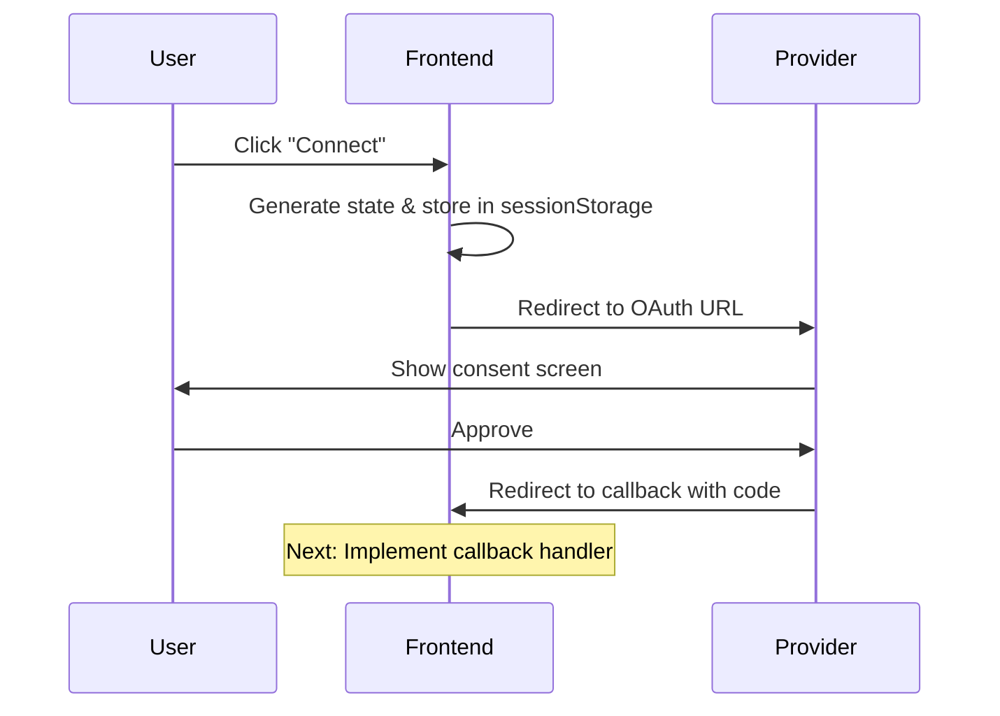

# OAuth Connector Implementation Guide

This guide outlines the steps to implement a new OAuth-based connector in the frontend, following the established patterns.

## Overview

```
Integration Card → Integration Page → OAuth Flow → Callback Handler → Connected State
```

## Step 1: Frontend Implementation

### 1.1 Create Icon Component
*Creates a reusable icon component that displays the service logo in integration cards and setup pages.*

Add the integration icon to `js-services/admin-frontend/src/assets/icons/index.tsx`:

```typescript
// Import the logo
import intercomPng from '../integration_logos/intercom.png';

// Create icon component
export const IntercomIcon = ({ size = 48 }: IconProps) => (
  
);
```

### 1.2 Create OAuth Utility
*Handles OAuth URL generation and redirects the user to the service's authorization page.*

Create `js-services/admin-frontend/src/utils/{service}OAuth.ts`:

```typescript
import { getConfig } from '../lib/config';

const getIntercomClientId = (): string => {
  const config = getConfig();
  const clientId = config.INTERCOM_CLIENT_ID;
  
  if (!clientId) {
    throw new Error('INTERCOM_CLIENT_ID is not configured');
  }
  return clientId;
};

export const authorizeIntercom = (): void => {
  const clientId = getIntercomClientId();
  const receiverUrl = `${window.location.origin}/integrations/intercom/callback`;
  const state = crypto.randomUUID();
  
  sessionStorage.setItem('intercom_oauth_state', state);
  
  const params = new URLSearchParams({
    client_id: clientId,
    state: state,
    response_type: 'code',
    redirect_uri: receiverUrl,
  });
  
  const authUrl = `https://app.intercom.io/oauth?${params.toString()}`;
  window.location.href = authUrl;
};
```

### 1.3 Register Integration
*Adds the new service to the global integrations list so it appears in the UI with proper metadata.*

Add to `js-services/admin-frontend/src/contexts/IntegrationsContext.tsx`:

```typescript
import { IntercomIcon } from '../assets/icons';

// In allIntegrations array:
{
  id: 'intercom',
  name: 'Intercom',
  Icon: ({ size = 64 }: { size?: number }) => <IntercomIcon size={size} />,
  rgb: '1, 198, 208',
  accessItems: [
    'Read conversations and messages',
    'Read contacts and users',
    'Read articles and help center content',
  ],
  comingSoon: false,
}
```

### 1.4 Create Integration Components
*Creates the UI components that handle the connection flow and display connection status.*

**Integration Component** (`js-services/admin-frontend/src/components/integrations/IntercomIntegration.tsx`):

```typescript
import { authorizeIntercom } from '../../utils/intercomOAuth';

export const IntercomIntegration: FC<IntercomIntegrationProps> = ({
  integration,
  isModalOpen,
  onModalOpenChange,
  renderInline = false,
  onComplete: onInlineComplete,
}) => {
  const handleConnect = () => {
    setHasError(false);
    setIsConnecting(true);
    authorizeIntercom();
  };

  // ... rest of component following BaseIntegration pattern
};
```

**Integration Page** (`js-services/admin-frontend/src/components/integration-pages/IntercomIntegrationPage.tsx`):

```typescript
export const IntercomIntegrationPage: FC = memo(() => {
  const { integrations } = useIntegrations();
  const integration = integrations.find((int) => int.id === 'intercom');
  
  return (
    <IntercomIntegration
      integration={integration}
      isModalOpen={true}
      onModalOpenChange={() => {}}
      renderInline={true}
      onComplete={handleComplete}
    />
  );
});
```

### 1.5 Add Routes and Navigation
*Connects the integration to the routing system so users can navigate to the setup page.*

**Add Route** in `js-services/admin-frontend/src/App.tsx`:

```typescript
import { IntercomIntegrationPage } from './components/integration-pages/IntercomIntegrationPage';

// In Routes:
<Route path="/integrations/intercom" element={<IntercomIntegrationPage />} />
```

**Add Navigation** in `js-services/admin-frontend/src/components/IntegrationCard.tsx`:

```typescript
const routeMap: Record<string, string> = {
  // ... other routes
  intercom: '/integrations/intercom',
};
```

### 1.6 Configure Environment Variables
*Sets up type-safe access to OAuth credentials from environment variables.*

**TypeScript Definitions** (`js-services/admin-frontend/src/vite-env.d.ts`):

```typescript
interface ImportMetaEnv {
  readonly VITE_INTERCOM_CLIENT_ID: string;
}
```

**Config Interface** (`js-services/admin-frontend/src/lib/config.ts`):

```typescript
declare module '@corporate-context/frontend-common' {
  interface EnvConfig {
    INTERCOM_CLIENT_ID?: string;
  }
}

// In getConfig():
if (import.meta.env.DEV) {
  return {
    INTERCOM_CLIENT_ID: import.meta.env.VITE_INTERCOM_CLIENT_ID,
  };
}
```

## File Structure

```
js-services/admin-frontend/src/
├── assets/icons/index.tsx                    # Add icon component
├── utils/{service}OAuth.ts                   # OAuth utility functions
├── contexts/IntegrationsContext.tsx          # Register integration
├── components/
│   ├── integrations/{Service}Integration.tsx # Main integration component
│   ├── integration-pages/
│   │   └── {Service}IntegrationPage.tsx     # Page wrapper
│   └── IntegrationCard.tsx                  # Add route mapping
├── App.tsx                                  # Add route
├── vite-env.d.ts                           # TypeScript definitions
└── lib/config.ts                           # Environment config
```

## Environment Variables

- **Development**: `VITE_INTERCOM_CLIENT_ID`
- **Production**: `INTERCOM_CLIENT_ID` (injected at runtime)

## Flow Diagram



## Step 2: Backend Implementation & Callback Handler

### 2.1 Create OAuth Callback Page Component
*Handles the OAuth callback from the service and exchanges the authorization code for tokens.*

Create `js-services/admin-frontend/src/components/integration-pages/{Service}OAuthCallbackPage.tsx`:

```typescript
import { useEffect, useState, useRef } from 'react';
import { useNavigate, useSearchParams } from 'react-router-dom';
import { apiClient } from '../../api/client';

enum CallbackStatus {
  Processing = 'processing',
  Success = 'success',
  Error = 'error',
}

const IntercomOAuthCallbackPage: FC = () => {
  const navigate = useNavigate();
  const [searchParams] = useSearchParams();
  const [status, setStatus] = useState<CallbackStatus>(CallbackStatus.Processing);
  const [errorMessage, setErrorMessage] = useState<string>('');
  const hasProcessed = useRef(false);

  useEffect(() => {
    if (hasProcessed.current) return;

    const handleCallback = async () => {
      hasProcessed.current = true;
      
      const code = searchParams.get('code');
      const state = searchParams.get('state');
      const error = searchParams.get('error');

      // Handle OAuth error
      if (error) {
        setStatus(CallbackStatus.Error);
        setErrorMessage(`OAuth error: ${error}`);
        setTimeout(() => navigate('/integrations/intercom?error=true'), 3000);
        return;
      }

      // Validate required parameters
      if (!code || !state) {
        setStatus(CallbackStatus.Error);
        setErrorMessage('Missing authorization code or state');
        setTimeout(() => navigate('/integrations/intercom?error=true'), 3000);
        return;
      }

      // Validate state matches stored value
      const storedState = sessionStorage.getItem('intercom_oauth_state');
      if (!storedState || storedState !== state) {
        setStatus(CallbackStatus.Error);
        setErrorMessage('Invalid state parameter - possible CSRF attack');
        setTimeout(() => navigate('/integrations/intercom?error=true'), 3000);
        return;
      }

      // Clear stored state
      sessionStorage.removeItem('intercom_oauth_state');

      try {
        // Exchange code for tokens via backend
        const response = await apiClient.post<{ success: boolean; redirectTo?: string | null }>(
          '/api/intercom/callback',
          { code, state }
        );

        setStatus(CallbackStatus.Success);
        setTimeout(() => {
          navigate('/integrations/intercom?success=true');
        }, 2000);
      } catch (error) {
        setStatus(CallbackStatus.Error);
        setErrorMessage('Failed to complete authorization. Please try again.');
        setTimeout(() => navigate('/integrations/intercom?error=true'), 3000);
      }
    };

    handleCallback();
  }, [searchParams, navigate]);

  // Render loading, success, or error states...
};
```

### 2.2 Add Callback Route
*Registers the callback page in the routing system.*

Add to `js-services/admin-frontend/src/App.tsx`:

```typescript
import { IntercomOAuthCallbackPage } from './components/integration-pages/IntercomOAuthCallbackPage';

// In Routes:
<Route path="/integrations/intercom/callback" element={<IntercomOAuthCallbackPage />} />
```

### 2.3 Create Backend OAuth Router
*Implements the server-side OAuth flow including token exchange and secure storage.*

Create `js-services/admin-backend/src/connectors/intercom/intercom-oauth-router.ts`:

```typescript
import { Router } from 'express';
import { requireUser } from '../../middleware/auth-middleware';
import { saveConfigValue, deleteConfigValue, getConfigValue } from '../../config';
import { logger } from '../../utils/logger';

const INTERCOM_TOKEN_URL = 'https://api.intercom.io/auth/eagle/token';
const INTERCOM_CONFIG_KEY_ACCESS_TOKEN = 'INTERCOM_ACCESS_TOKEN';
const INTERCOM_CONFIG_KEY_TOKEN_TYPE = 'INTERCOM_TOKEN_TYPE';

const intercomOAuthRouter = Router();

function getIntercomClientId(): string {
  const value = process.env.INTERCOM_CLIENT_ID;
  if (!value) {
    throw new Error('INTERCOM_CLIENT_ID environment variable is required');
  }
  return value;
}

function getIntercomClientSecret(): string {
  const value = process.env.INTERCOM_CLIENT_SECRET;
  if (!value) {
    throw new Error('INTERCOM_CLIENT_SECRET environment variable is required');
  }
  return value;
}

/**
 * POST /api/intercom/callback
 * Handles OAuth callback and exchanges code for tokens
 */
intercomOAuthRouter.post('/callback', requireUser, async (req, res) => {
  try {
    const { code, state } = req.body;
    const tenantId = req.user?.tenantId;

    if (!tenantId) {
      return res.status(400).json({ error: 'No tenant found' });
    }

    if (!code || !state) {
      return res.status(400).json({ error: 'Missing code or state' });
    }

    // Basic state validation
    if (typeof state !== 'string' || state.length < 10) {
      logger.error('Invalid state parameter in OAuth callback', { tenantId });
      return res.status(400).json({ error: 'Invalid state parameter' });
    }

    logger.info('Processing OAuth callback', { tenantId, hasCode: !!code });

    // Exchange code for tokens
    const tokenPayload = {
      code,
      client_id: getIntercomClientId(),
      client_secret: getIntercomClientSecret(),
    };

    const tokenResponse = await fetch(INTERCOM_TOKEN_URL, {
      method: 'POST',
      headers: {
        'Content-Type': 'application/json',
        Accept: 'application/json',
      },
      body: JSON.stringify(tokenPayload),
    });

    if (!tokenResponse.ok) {
      const errorText = await tokenResponse.text();
      logger.error('Token exchange failed', {
        status: tokenResponse.status,
        error: errorText,
        tenantId,
      });
      throw new Error(`Failed to exchange code for tokens: ${tokenResponse.status}`);
    }

    const tokens = await tokenResponse.json();

    // Validate token response
    if (!tokens?.access_token) {
      logger.error('Missing access token in response', { tenantId });
      throw new Error('Missing access token in response');
    }

    // Save tokens to SSM Parameter Store (sensitive) and database (non-sensitive)
    await saveConfigValue(INTERCOM_CONFIG_KEY_ACCESS_TOKEN, tokens.access_token, tenantId);
    
    if (tokens.token_type) {
      await saveConfigValue(INTERCOM_CONFIG_KEY_TOKEN_TYPE, tokens.token_type, tenantId);
    }

    logger.info('OAuth flow completed successfully', { tenantId });
    return res.json({ success: true, redirectTo: null });
    
  } catch (error) {
    logger.error('OAuth callback failed', error);
    return res.status(500).json({ error: 'OAuth callback failed' });
  }
});

/**
 * GET /api/intercom/status
 * Get connection status
 */
intercomOAuthRouter.get('/status', requireUser, async (req, res) => {
  try {
    const tenantId = req.user?.tenantId;
    if (!tenantId) {
      return res.status(400).json({ error: 'No tenant found' });
    }

    // Check if we have an access token stored
    const accessToken = await getConfigValue(INTERCOM_CONFIG_KEY_ACCESS_TOKEN, tenantId);
    const hasAccessToken = !!accessToken;

    return res.json({
      connected: hasAccessToken,
      configured: hasAccessToken,
    });
  } catch (error) {
    logger.error('Failed to fetch status', error);
    return res.status(500).json({ error: 'Failed to fetch status' });
  }
});

/**
 * DELETE /api/intercom/disconnect
 * Disconnect and remove stored tokens
 */
intercomOAuthRouter.delete('/disconnect', requireUser, async (req, res) => {
  try {
    const tenantId = req.user?.tenantId;
    if (!tenantId) {
      return res.status(400).json({ error: 'No tenant found' });
    }

    // Delete all related config values
    await deleteConfigValue(INTERCOM_CONFIG_KEY_ACCESS_TOKEN, tenantId);
    await deleteConfigValue(INTERCOM_CONFIG_KEY_TOKEN_TYPE, tenantId);

    logger.info('Disconnected successfully', { tenantId });
    return res.json({ success: true });
  } catch (error) {
    logger.error('Failed to disconnect', error);
    return res.status(500).json({ error: 'Failed to disconnect' });
  }
});

export { intercomOAuthRouter };
```

### 2.4 Configure Sensitive Keys
*Defines which configuration keys should be stored securely in SSM vs. database.*

Create `js-services/admin-backend/src/connectors/intercom/intercom-config-keys.ts`:

```typescript
import { ConfigKey } from '../../config/types';

// Sensitive keys (stored in SSM Parameter Store with encryption)
export const INTERCOM_SENSITIVE_KEYS = [
  'INTERCOM_ACCESS_TOKEN',
] as const satisfies readonly ConfigKey[];

// Non-sensitive keys (stored in regular database)
export const INTERCOM_NON_SENSITIVE_KEYS = [
  'INTERCOM_TOKEN_TYPE',
] as const satisfies readonly ConfigKey[];
```

Add to `js-services/admin-backend/src/config/configKeys.ts`:

```typescript
import {
  INTERCOM_SENSITIVE_KEYS,
  INTERCOM_NON_SENSITIVE_KEYS,
} from '../connectors/intercom/intercom-config-keys.js';

export const SENSITIVE_KEYS: ConfigKey[] = [
  // ... existing keys
  ...INTERCOM_SENSITIVE_KEYS,
] as const;

export const NON_SENSITIVE_KEYS: ConfigKey[] = [
  // ... existing keys  
  ...INTERCOM_NON_SENSITIVE_KEYS,
] as const;
```

### 2.5 Register Backend Router
*Connects the OAuth router to the main Express application.*

Create `js-services/admin-backend/src/connectors/intercom/intercom-router.ts`:

```typescript
import { Router } from 'express';
import { intercomOAuthRouter } from './intercom-oauth-router';

const intercomRouter = Router();

// Mount OAuth routes
intercomRouter.use('', intercomOAuthRouter);

export { intercomRouter };
```

Add to `js-services/admin-backend/src/server.ts`:

```typescript
import { intercomRouter } from './connectors/intercom/intercom-router.js';

// Mount route controllers
app.use('/api/intercom', intercomRouter);
```

### 2.6 Create Frontend API Client
*Provides React hooks for status checking and disconnection.*

Create `js-services/admin-frontend/src/connectors/intercom/api.ts`:

```typescript
import { useQuery, useMutation, useQueryClient } from '@tanstack/react-query';
import { apiClient } from '../../api/client';
import { connectorConfigQueryKey } from '../../api/config';

interface IntercomStatus {
  connected: boolean;
  configured: boolean;
}

const fetchIntercomStatus = (): Promise<IntercomStatus> =>
  apiClient.get<IntercomStatus>('/api/intercom/status');

const intercomStatusQueryKey = [...connectorConfigQueryKey, 'intercom'];

const useIntercomStatus = () => {
  const { data, isLoading, error } = useQuery({
    queryKey: intercomStatusQueryKey,
    queryFn: fetchIntercomStatus,
  });

  return { data, isLoading, error };
};

const disconnectIntercom = (): Promise<{ success: boolean }> =>
  apiClient.delete<{ success: boolean }>('/api/intercom/disconnect');

const useIntercomDisconnect = () => {
  const queryClient = useQueryClient();

  return useMutation({
    mutationFn: disconnectIntercom,
    onSuccess: () => {
      queryClient.invalidateQueries({ queryKey: intercomStatusQueryKey });
      queryClient.invalidateQueries({ queryKey: connectorConfigQueryKey });
    },
  });
};

export { 
  type IntercomStatus, 
  useIntercomStatus, 
  useIntercomDisconnect,
  intercomStatusQueryKey 
};
```

### 2.7 Add Disconnect Functionality to UI
*Updates the integration component to show connection status and provide disconnect option.*

Update `js-services/admin-frontend/src/components/integrations/IntercomIntegration.tsx`:

```typescript
import { useIntercomStatus, useIntercomDisconnect } from '../../connectors/intercom/api';

export const IntercomIntegration: FC<IntercomIntegrationProps> = ({ ... }) => {
  const { data: intercomStatus } = useIntercomStatus();
  const disconnectMutation = useIntercomDisconnect();
  const isConnected = intercomStatus?.connected ?? false;

  const handleDisconnect = async () => {
    try {
      await disconnectMutation.mutateAsync();
      setHasError(false);
      setShowDisconnectSuccess(true);
      setTimeout(() => setShowDisconnectSuccess(false), 3000);
    } catch (error) {
      console.error('Failed to disconnect:', error);
      setHasError(true);
    }
  };

  // In the connected state UI:
  {isConnected && (
    <Flex direction="row" gap={8}>
      <Button onClick={handleConnect} kind="secondary" size="sm">
        Reconnect
      </Button>
      <Button 
        onClick={handleDisconnect} 
        kind="danger" 
        size="sm"
        loading={disconnectMutation.isPending}
      >
        {disconnectMutation.isPending ? 'Disconnecting...' : 'Disconnect'}
      </Button>
    </Flex>
  )}
};
```

## Token Storage Architecture

### SSM Parameter Store Structure
- **Sensitive tokens**: `/{tenant_id}/api-key/INTERCOM_ACCESS_TOKEN`
- **Non-sensitive metadata**: `/{tenant_id}/config/INTERCOM_TOKEN_TYPE` (database)

### Security Features
- ✅ **Encrypted storage** in AWS SSM Parameter Store
- ✅ **Tenant isolation** with per-tenant parameter paths  
- ✅ **CSRF protection** via state parameter validation
- ✅ **Authenticated endpoints** using `requireUser` middleware
- ✅ **Secure token exchange** with client secret validation

## Step 3: Database Schema & Migrations

### Adding New Connector Types

When implementing a new connector, you must add it to the database constraint that validates connector types:

```sql
-- Create migration: migrations/control/YYYYMMDD000000_add_<connector>_connector_type.sql
ALTER TABLE connector_installations DROP CONSTRAINT valid_connector_type;

ALTER TABLE connector_installations ADD CONSTRAINT valid_connector_type CHECK (type IN (
    'slack', 'github', 'linear', 'notion', 'google_drive', 'google_email',
    'hubspot', 'salesforce', 'jira', 'confluence', 'gong', 'gather',
    'trello', 'zendesk', 'asana', 'intercom'  -- Add your new connector here
));
```

**⚠️ Critical**: Without this migration, the `installConnector` function will fail silently due to constraint violations, and no connector records will be created in the database.

### Running Migrations

```bash
# Run control database migrations
mise migrations migrate --control

# Verify migration applied
mise migrations status
```

## Testing the Implementation

### 1. Verify SSM Parameters
Use the provided script to check token storage:

```bash
python scripts/check_intercom_ssm.py --tenant <tenant_id>
```

### 2. Verify Connector Installation Records
Check that connector records are being created in the database:

```bash
python scripts/check_connector_installations.py --tenant-id <tenant_id>
```

### 3. Test Complete Flow
1. **Connect**: Navigate to `/integrations/intercom` → Click "Connect" → Complete OAuth
2. **Status**: Verify green "Connected" status appears
3. **Database**: Verify connector record created with `status = 'active'`
4. **Disconnect**: Click "Disconnect" → Verify tokens removed from SSM
5. **Database**: Verify connector record updated with `status = 'disconnected'`
6. **Reconnect**: Verify flow works again after disconnect

### 4. Common Issues

**Problem**: Connector installations not appearing in database
- **Cause**: Missing connector type in database constraint
- **Solution**: Create and run migration to add connector type to `valid_connector_type` constraint

**Problem**: OAuth callback fails with 500 error
- **Cause**: Missing environment variables (`INTERCOM_CLIENT_ID`, `INTERCOM_CLIENT_SECRET`)
- **Solution**: Verify environment variables are set in all environments

---

This completes the full OAuth implementation with secure token storage, database integration, status checking, and disconnect functionality. The integration now provides a complete user experience from connection through disconnection with proper data persistence.
