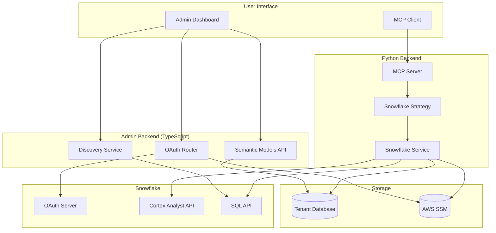
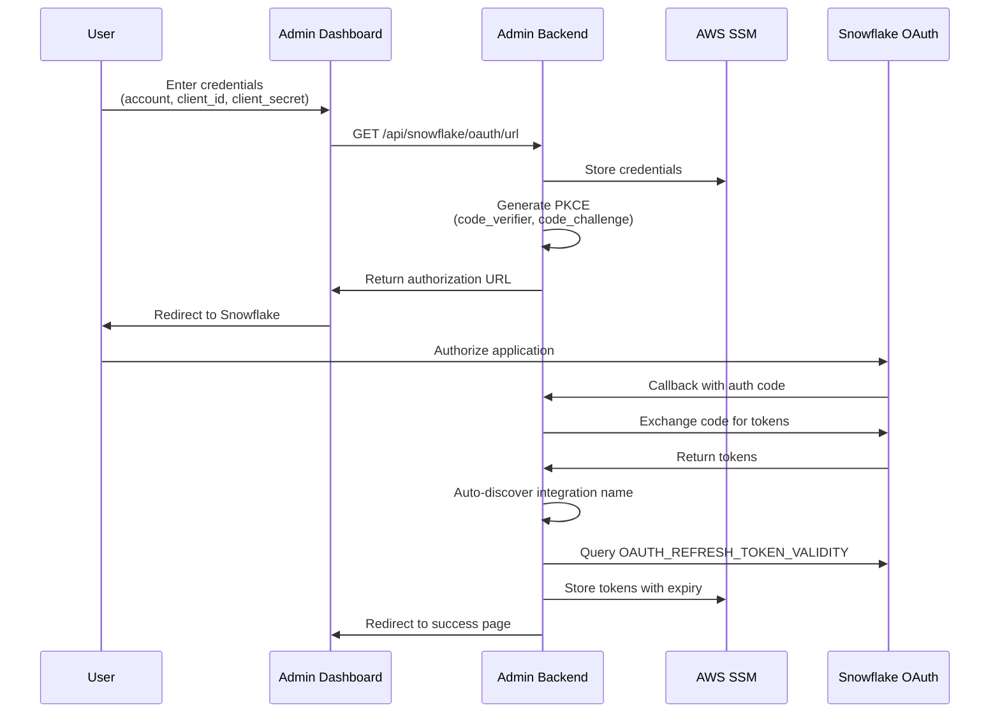
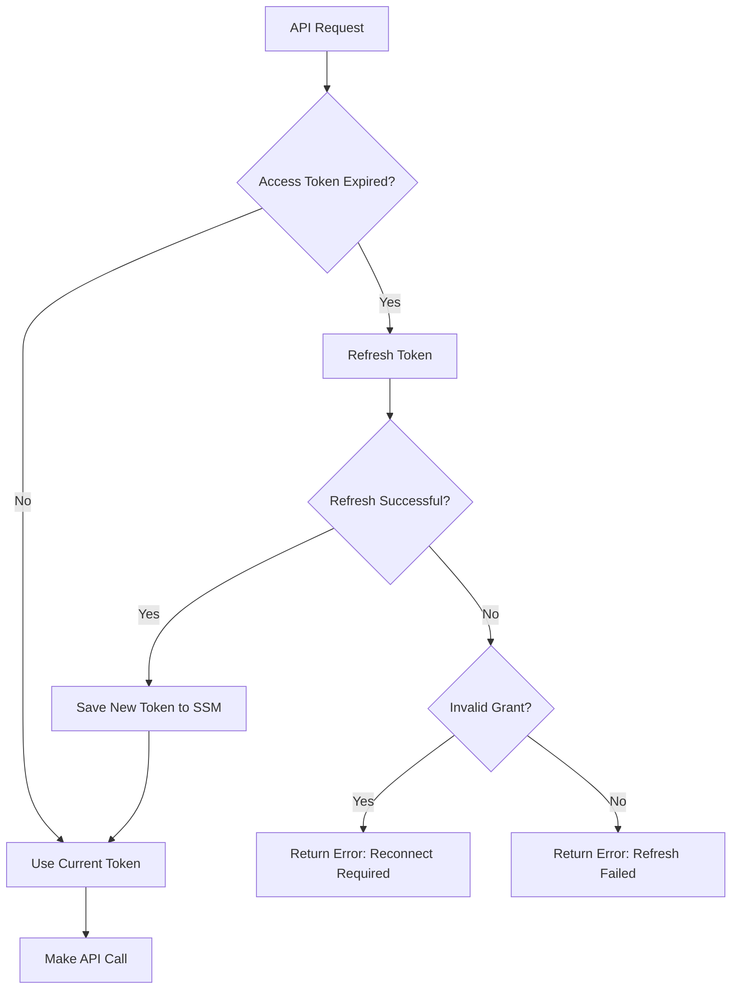
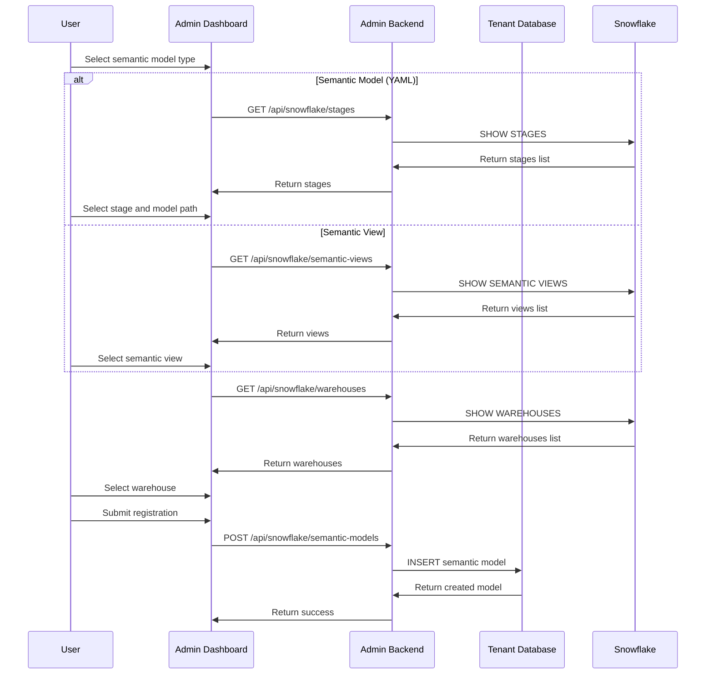
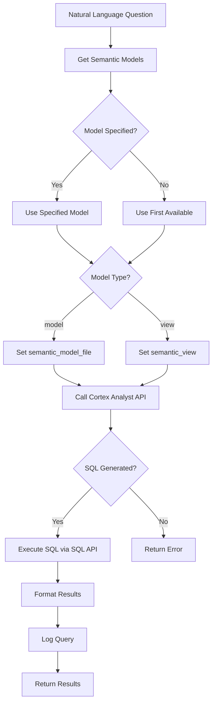
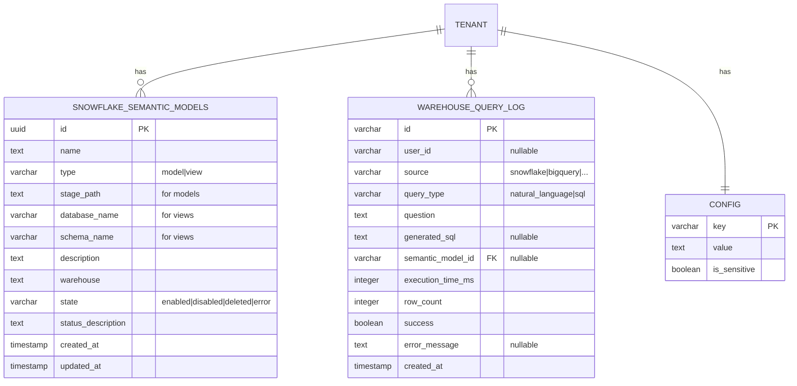
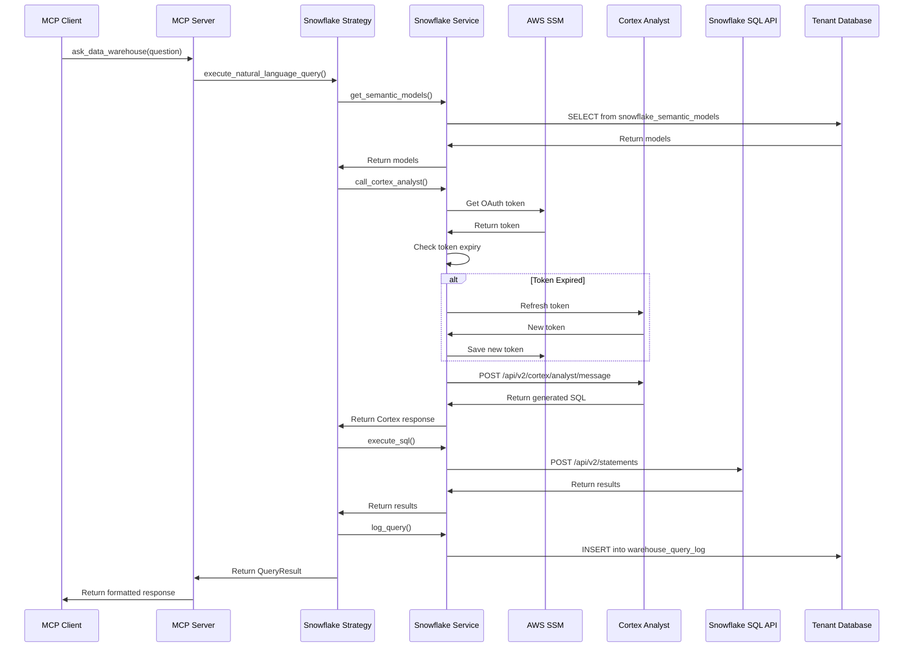

# Snowflake Connector Technical Documentation

This document provides comprehensive technical documentation for the Snowflake Connector in Grapevine, covering OAuth configuration, semantic model registration, MCP tool functionality, and the underlying data models.

## Table of Contents

1. [Architecture Overview](#architecture-overview)
2. [OAuth Configuration](#oauth-configuration)
3. [Semantic Model Registration](#semantic-model-registration)
4. [MCP Tools](#mcp-tools)
5. [Database Schema](#database-schema)
6. [API Reference](#api-reference)
7. [Configuration Reference](#configuration-reference)

---

## Architecture Overview

The Snowflake connector enables natural language querying of Snowflake data warehouses through Cortex Analyst. It consists of several interconnected components:



### Component Responsibilities

| Component | Location | Responsibility |
|-----------|----------|----------------|
| **OAuth Router** | `js-services/admin-backend/src/connectors/snowflake/router/snowflake-oauth-router.ts` | OAuth flow, token management, discovery endpoints |
| **Semantic Models API** | `js-services/admin-backend/src/connectors/snowflake/router/snowflake-semantic-models-router.ts` | CRUD operations for semantic models |
| **Snowflake Service (TS)** | `js-services/admin-backend/src/connectors/snowflake/snowflake-service.ts` | Token refresh, Snowflake queries |
| **Snowflake Strategy** | `src/warehouses/snowflake_strategy.py` | Query execution strategy pattern |
| **Snowflake Service (Python)** | `src/warehouses/snowflake_service.py` | Cortex Analyst calls, SQL execution, logging |
| **MCP Tools** | `src/mcp/tools/ask_data_warehouse.py`, `execute_data_warehouse_sql.py` | Natural language and SQL query tools |

---

## OAuth Configuration

### OAuth Flow Overview

The Snowflake connector uses OAuth 2.0 with PKCE (Proof Key for Code Exchange) for secure authentication.



### OAuth Configuration Parameters

| Parameter | Description | Storage Location |
|-----------|-------------|------------------|
| `SNOWFLAKE_ACCOUNT_IDENTIFIER` | Snowflake account ID (e.g., `org-account123`) | Tenant DB `config` table |
| `SNOWFLAKE_CLIENT_ID` | OAuth client ID from Snowflake integration | Tenant DB `config` table |
| `SNOWFLAKE_CLIENT_SECRET` | OAuth client secret | AWS SSM (encrypted) |
| `SNOWFLAKE_OAUTH_TOKEN_PAYLOAD` | JSON-serialized token with access/refresh tokens | AWS SSM (encrypted) |
| `SNOWFLAKE_OAUTH_AUTHORIZATION_ENDPOINT` | Custom auth endpoint (optional) | Tenant DB `config` table |
| `SNOWFLAKE_OAUTH_TOKEN_ENDPOINT` | Custom token endpoint (optional) | Tenant DB `config` table |
| `SNOWFLAKE_INTEGRATION_NAME` | Auto-discovered integration name | Tenant DB `config` table |

### Token Structure

```typescript
interface SnowflakeOauthToken {
  access_token: string;
  refresh_token: string;
  access_token_expires_at: string;      // ISO 8601 format
  refresh_token_expires_at?: string;    // ISO 8601 format
  refresh_token_validity_seconds?: number; // Default: 7776000 (90 days)
  username?: string;
}
```

### Token Refresh Logic

The connector implements automatic token refresh:

1. **Access Token Refresh**: Automatically refreshed when expired before any API call
2. **Refresh Token Validity**: Queried from Snowflake's `DESCRIBE SECURITY INTEGRATION` command
3. **Proactive Refresh Job**: Background job refreshes tokens within 7 days of expiry



### PKCE Implementation

```typescript
// Generate 128-character random code verifier
function generateCodeVerifier(): string {
  return crypto.randomBytes(96).toString('base64url');
}

// SHA256 hash of code verifier
function generateCodeChallenge(codeVerifier: string): string {
  return crypto.createHash('sha256').update(codeVerifier).digest('base64url');
}
```

---

## Semantic Model Registration

### Semantic Model Types

The connector supports two types of semantic models:

| Type | Description | Identifier | Example |
|------|-------------|------------|---------|
| **Model** | YAML files stored in Snowflake stages | `stage_path` | `@MY_STAGE/model.yaml` |
| **View** | Database semantic view objects | `database_name.schema_name.name` | `DB.SCHEMA.MY_VIEW` |

### Registration Flow



### Semantic Model States

| State | Description |
|-------|-------------|
| `enabled` | Model is active and available for queries |
| `disabled` | Model exists but is temporarily disabled |
| `deleted` | Soft-deleted (not visible in lists) |
| `error` | Model has configuration or validation errors |

---

## MCP Tools

### `ask_data_warehouse`

Natural language to SQL translation and execution via Cortex Analyst.



**Parameters:**

| Parameter | Type | Required | Default | Description |
|-----------|------|----------|---------|-------------|
| `question` | string | Yes | - | Natural language question |
| `source` | string | No | `"snowflake"` | Data warehouse source |
| `semantic_model_id` | string | No | First available | Specific semantic model to use |
| `limit` | int | No | 100 | Maximum rows to return (1-1000) |

**Response:**

```json
{
  "success": true,
  "results": [{"column1": "value1", "column2": "value2"}],
  "generated_sql": "SELECT column1, column2 FROM table",
  "explanation": "Optional explanation from Cortex Analyst",
  "row_count": 10,
  "execution_time_ms": 1500,
  "error": null
}
```

### `execute_data_warehouse_sql`

Direct SQL execution against Snowflake (READ-ONLY).

**Parameters:**

| Parameter | Type | Required | Default | Description |
|-----------|------|----------|---------|-------------|
| `sql` | string | Yes | - | SQL query to execute |
| `source` | string | No | `"snowflake"` | Data warehouse source |
| `warehouse` | string | No | User default | Warehouse for query execution |
| `limit` | int | No | 100 | Maximum rows to return (1-1000) |

**Security:**
- READ-ONLY operations only
- Uses user's OAuth token (respects Snowflake RBAC)
- All queries logged for audit

---

## Database Schema

### `snowflake_semantic_models` Table

Stores semantic model and view registrations per tenant.

```sql
CREATE TABLE snowflake_semantic_models (
    id UUID PRIMARY KEY DEFAULT gen_random_uuid(),
    name TEXT NOT NULL,
    type VARCHAR(50) NOT NULL DEFAULT 'model'
        CHECK (type IN ('model', 'view')),

    -- For semantic models (YAML files in stages)
    stage_path TEXT,

    -- For semantic views (database objects)
    database_name VARCHAR(255),
    schema_name VARCHAR(255),

    -- Common fields
    description TEXT,
    warehouse TEXT,
    state VARCHAR(50) NOT NULL DEFAULT 'enabled'
        CHECK (state IN ('enabled', 'disabled', 'deleted', 'error')),
    status_description TEXT,
    created_at TIMESTAMP WITH TIME ZONE NOT NULL DEFAULT CURRENT_TIMESTAMP,
    updated_at TIMESTAMP WITH TIME ZONE NOT NULL DEFAULT CURRENT_TIMESTAMP
);

-- Unique constraint for semantic models (stage-based)
CREATE UNIQUE INDEX idx_snowflake_semantic_models_model_unique
ON snowflake_semantic_models (stage_path)
WHERE type = 'model' AND stage_path IS NOT NULL;

-- Unique constraint for semantic views (database objects)
CREATE UNIQUE INDEX idx_snowflake_semantic_models_view_unique
ON snowflake_semantic_models (database_name, schema_name, name)
WHERE type = 'view' AND database_name IS NOT NULL AND schema_name IS NOT NULL;

-- Type-specific validation constraints
ALTER TABLE snowflake_semantic_models
ADD CONSTRAINT snowflake_semantic_models_model_requires_stage_path
CHECK (type != 'model' OR stage_path IS NOT NULL);

ALTER TABLE snowflake_semantic_models
ADD CONSTRAINT snowflake_semantic_models_view_requires_db_schema
CHECK (type != 'view' OR (database_name IS NOT NULL AND schema_name IS NOT NULL));
```

### `warehouse_query_log` Table

Logs all warehouse queries for analytics and debugging.

```sql
CREATE TABLE warehouse_query_log (
    id VARCHAR(255) PRIMARY KEY,
    user_id VARCHAR(255),                    -- NULL for system queries
    source VARCHAR(50) NOT NULL,             -- "snowflake", "bigquery", etc.
    query_type VARCHAR(50) NOT NULL,         -- "natural_language" or "sql"
    question TEXT NOT NULL,                  -- Original question or SQL
    generated_sql TEXT,                      -- NULL if query_type="sql"
    semantic_model_id VARCHAR(255),          -- NULL if not applicable
    execution_time_ms INTEGER,
    row_count INTEGER,
    success BOOLEAN NOT NULL,
    error_message TEXT,
    created_at TIMESTAMP WITH TIME ZONE NOT NULL DEFAULT CURRENT_TIMESTAMP
);

-- Indexes for common query patterns
CREATE INDEX idx_warehouse_query_log_user_source
    ON warehouse_query_log(user_id, source);
CREATE INDEX idx_warehouse_query_log_created_at
    ON warehouse_query_log(created_at DESC);
CREATE INDEX idx_warehouse_query_log_source_success
    ON warehouse_query_log(source, success);
```

### Entity Relationship Diagram



---

## API Reference

### OAuth Endpoints

| Method | Endpoint | Description |
|--------|----------|-------------|
| `GET` | `/api/snowflake/status` | Get connection status |
| `GET` | `/api/snowflake/oauth/url` | Generate OAuth authorization URL |
| `GET` | `/api/snowflake/oauth/callback` | OAuth callback handler |
| `POST` | `/api/snowflake/test-connection` | Test connection validity |
| `DELETE` | `/api/snowflake/disconnect` | Disconnect and clean up |

### Discovery Endpoints

| Method | Endpoint | Description |
|--------|----------|-------------|
| `GET` | `/api/snowflake/stages` | List Snowflake stages |
| `GET` | `/api/snowflake/warehouses` | List warehouses |
| `GET` | `/api/snowflake/databases` | List databases |
| `GET` | `/api/snowflake/semantic-views` | List semantic views |

### Semantic Models Endpoints

| Method | Endpoint | Description |
|--------|----------|-------------|
| `GET` | `/api/snowflake/semantic-models` | List all semantic models |
| `GET` | `/api/snowflake/semantic-models/:id` | Get specific model |
| `POST` | `/api/snowflake/semantic-models` | Create model/view |
| `PUT` | `/api/snowflake/semantic-models/:id` | Update model/view |
| `DELETE` | `/api/snowflake/semantic-models/:id` | Delete model/view (soft) |

### Create Semantic Model Request

```json
{
  "name": "Sales Analytics",
  "type": "model",
  "stage_path": "@MY_STAGE/sales_model.yaml",
  "warehouse": "COMPUTE_WH",
  "description": "Semantic model for sales analytics"
}
```

```json
{
  "name": "Revenue View",
  "type": "view",
  "database_name": "ANALYTICS",
  "schema_name": "PUBLIC",
  "warehouse": "COMPUTE_WH",
  "description": "Semantic view for revenue metrics"
}
```

---

## Configuration Reference

### Environment Variables

| Variable | Description | Required |
|----------|-------------|----------|
| `AWS_REGION` | AWS region for SSM | Yes |
| `SQS_WEBHOOK_QUEUE` | SQS queue for webhooks | No |

### SSM Parameter Paths

| Path Pattern | Description |
|--------------|-------------|
| `/{tenant_id}/api-key/SNOWFLAKE_OAUTH_TOKEN_PAYLOAD` | OAuth tokens (JSON) |
| `/{tenant_id}/api-key/SNOWFLAKE_CLIENT_SECRET` | Client secret |

### Snowflake API Endpoints

| API | URL Pattern |
|-----|-------------|
| OAuth Authorization | `https://{account}.snowflakecomputing.com/oauth/authorize` |
| OAuth Token | `https://{account}.snowflakecomputing.com/oauth/token-request` |
| Cortex Analyst | `https://{account}.snowflakecomputing.com/api/v2/cortex/analyst/message` |
| SQL API | `https://{account}.snowflakecomputing.com/api/v2/statements` |

---

## Query Execution Flow



---

## Error Handling

### Common Error Scenarios

| Error | Cause | Resolution |
|-------|-------|------------|
| `No Snowflake OAuth token found` | Not connected | Complete OAuth flow |
| `invalid_grant` | Refresh token expired | Reconnect Snowflake account |
| `No semantic models configured` | No models registered | Register semantic model |
| `Cortex Analyst did not generate SQL` | Question not understood | Rephrase question |
| `Semantic model not found` | Invalid model ID | Use valid model ID |

### Error Response Format

```json
{
  "success": false,
  "error": "Error description",
  "results": [],
  "row_count": 0
}
```

---

## Security Considerations

1. **Token Storage**: All sensitive credentials stored in AWS SSM (encrypted at rest)
2. **PKCE**: OAuth flow uses PKCE to prevent authorization code interception
3. **Token Refresh**: Automatic refresh prevents exposure of long-lived tokens
4. **RBAC**: Uses user's Snowflake permissions (row-level security respected)
5. **Read-Only**: SQL execution tool restricted to SELECT queries
6. **Audit Logging**: All queries logged to `warehouse_query_log` table

---

## File Reference

### Python Backend

| File | Purpose |
|------|---------|
| `src/warehouses/snowflake_service.py` | OAuth, token refresh, API calls |
| `src/warehouses/snowflake_strategy.py` | Query execution strategy |
| `src/warehouses/models.py` | Pydantic data models |
| `src/warehouses/strategy.py` | Abstract base strategy |
| `src/mcp/tools/ask_data_warehouse.py` | Natural language query tool |
| `src/mcp/tools/execute_data_warehouse_sql.py` | Direct SQL query tool |

### TypeScript Backend

| File | Purpose |
|------|---------|
| `js-services/admin-backend/src/connectors/snowflake/router/snowflake-router.ts` | Main router |
| `js-services/admin-backend/src/connectors/snowflake/router/snowflake-oauth-router.ts` | OAuth endpoints |
| `js-services/admin-backend/src/connectors/snowflake/router/snowflake-semantic-models-router.ts` | CRUD endpoints |
| `js-services/admin-backend/src/connectors/snowflake/snowflake-service.ts` | Business logic |
| `js-services/admin-backend/src/connectors/snowflake/snowflake-client.ts` | HTTP client |
| `js-services/admin-backend/src/connectors/snowflake/snowflake-config.ts` | Config management |
| `js-services/admin-backend/src/connectors/snowflake/snowflake-semantic-models-db.ts` | Database operations |

### Migrations

| File | Purpose |
|------|---------|
| `migrations/tenant/20251119152124_create_snowflake_semantic_models_table.sql` | Semantic models table |
| `migrations/tenant/20251119123725_create_warehouse_query_log_table.sql` | Query log table |
